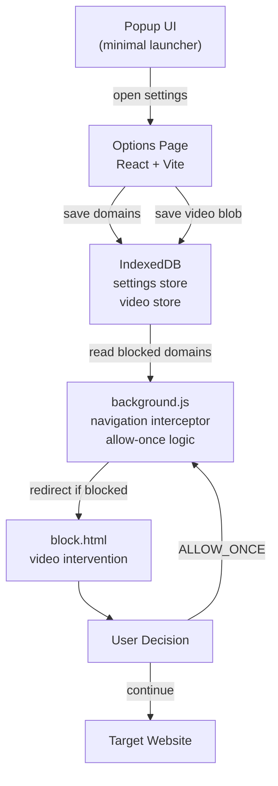

# dikstract

Unpack the `dist/` folder in `chrome://extensions` (Enable Developer Mode → Load unpacked → select `dist/`).


## Architecture


```mermaid
flowchart TD

    Popup["Popup UI<br/>(minimal launcher)"]

    Options["Options Page<br/>React + Vite"]

    DB["IndexedDB<br/>settings store<br/>video store"]

    BG["background.js<br/>navigation interceptor<br/>allow-once logic"]

    Block["block.html<br/>video intervention"]

    Decision["User Decision"]

    Target["Target Website"]

    Popup -->|open settings| Options

    Options -->|save domains| DB
    Options -->|save video blob| DB

    DB -->|read blocked domains| BG

    BG -->|redirect if blocked| Block

    Block --> Decision

    Decision -->|ALLOW_ONCE| BG
    Decision -->|continue| Target
````

```
```
